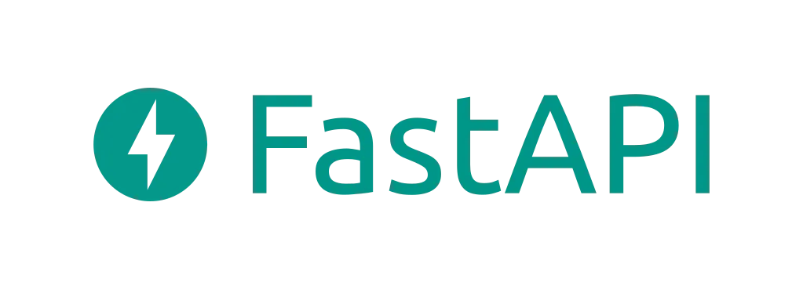
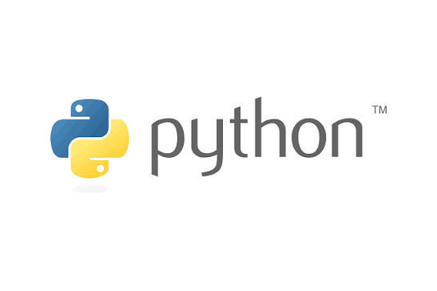
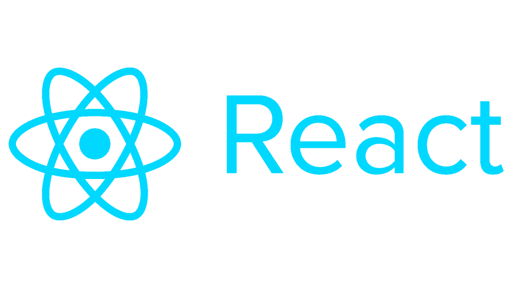

```{=html}
<div class="blog-shell">
<nav class="blog-nav" aria-label="Navegación del blog"><a class="blog-brand" href="index.html"><span class="brand-mark">&lt;/&gt;</span><strong>Jona<span>Blog</span></strong></a><div class="blog-links"><a class="active" href="index.html">Inicio</a><a href="articulos.html">Artículos</a><a href="categorias.html">Categorías</a><a href="social.html">Social Media</a></div><a class="back-link" href="../index.html">Volver al portafolio</a></nav>
<main class="blog-main">
<section class="blog-hero"><div class="hero-copy"><span class="eyebrow-label">BLOG DE APRENDIZAJE</span><h1>Ideas, práctica y evolución.</h1><p>Un espacio para documentar lo que voy aprendiendo en tecnología: cómo abordo un reto, qué decisiones tomo y qué me llevo de cada experiencia.</p><a class="button-primary" href="articulos.html">Explorar artículos <span aria-hidden="true">→</span></a></div><div class="hero-art" aria-hidden="true"><div class="code-window"><div class="window-dots"><i></i><i></i><i></i></div><div class="code-line"><b>const</b> aprendizaje = {</div><div class="code-line indent">curiosidad: <em>"siempre"</em>,</div><div class="code-line indent">práctica: <em>true</em>,</div><div class="code-line indent">progreso: <em>"paso a paso"</em></div><div class="code-line">};</div><span class="code-stamp">UNA IDEA A LA VEZ</span></div></div></section>
<section class="latest-section"><div class="blog-section-heading"><div><span class="eyebrow-label">LECTURAS RECIENTES</span><h2>Lo más reciente</h2></div><a href="articulos.html" class="text-link">Ver todos los artículos <span aria-hidden="true">→</span></a></div></section>
</main>
```

::: {#latest-posts}
:::

```{=html}
<main class="blog-main blog-main-after-listing">
<section class="category-preview"><div class="blog-section-heading"><div><span class="eyebrow-label">TEMAS DEL BLOG</span><h2>Aprender por caminos distintos</h2></div><a href="categorias.html" class="text-link">Ver categorías <span aria-hidden="true">→</span></a></div><div class="category-tiles"><a class="category-tile tile-kotlin" href="categorias.html#kotlin"><span class="category-tile-art"></span><span class="tile-label">KOTLIN</span><strong>Desarrollo móvil</strong><span class="category-tile-copy">Aplicaciones y experiencias Android.</span><span class="category-tile-link">Explorar tema <span aria-hidden="true">→</span></span></a><a class="category-tile tile-fastapi" href="categorias.html#fastapi"><span class="category-tile-art"></span><span class="tile-label">FASTAPI</span><strong>Servicios web</strong><span class="category-tile-copy">Una ruta para explorar APIs con Python.</span><span class="category-tile-link">Explorar tema <span aria-hidden="true">→</span></span></a><a class="category-tile tile-python" href="categorias.html#python"><span class="category-tile-art"></span><span class="tile-label">PYTHON</span><strong>Fundamentos</strong><span class="category-tile-copy">Práctica, automatización y nuevos retos.</span><span class="category-tile-link">Explorar tema <span aria-hidden="true">→</span></span></a><a class="category-tile tile-react" href="categorias.html#react"><span class="category-tile-art"></span><span class="tile-label">REACT</span><strong>Interfaces web</strong><span class="category-tile-copy">Construcción de experiencias para navegador.</span><span class="category-tile-link">Explorar tema <span aria-hidden="true">→</span></span></a></div></section><section class="subscribe-note"><span class="note-mark">JR</span><div><strong>Un cuaderno que sigue creciendo</strong><p>Cada nueva entrada recoge una parte real de mi recorrido académico y profesional.</p></div><a class="button-secondary" href="articulos.html">Leer el blog</a></section>
</main>
<footer class="blog-footer"><div class="blog-footer-inner"><div><strong>Jonathan Rodríguez</strong><p>Estudiante de Ingeniería en Tecnología de la Información e Innovación Digital · UPChiapas</p></div><div class="blog-footer-links"><a href="https://github.com/JonnySDE" target="_blank" rel="noopener noreferrer" aria-label="GitHub" title="GitHub"><svg viewBox="0 0 24 24" aria-hidden="true" focusable="false"><path d="M12 .8a11.2 11.2 0 0 0-3.54 21.83c.56.1.76-.24.76-.54v-2.1c-3.1.68-3.75-1.32-3.75-1.32-.51-1.29-1.25-1.63-1.25-1.63-1.02-.7.08-.69.08-.69 1.13.08 1.72 1.16 1.72 1.16 1 1.72 2.62 1.22 3.26.93.1-.73.39-1.23.71-1.51-2.48-.28-5.09-1.24-5.09-5.52 0-1.22.43-2.21 1.16-2.99-.12-.28-.5-1.42.11-2.96 0 0 .95-.3 3.08 1.14a10.7 10.7 0 0 1 5.6 0c2.13-1.44 3.08-1.14 3.08-1.14.61 1.54.23 2.68.11 2.96.72.78 1.16 1.77 1.16 2.99 0 4.29-2.62 5.23-5.11 5.51.4.35.76 1.03.76 2.08v3.09c0 .3.2.65.77.54A11.2 11.2 0 0 0 12 .8Z"/></svg></a><a href="https://www.linkedin.com/in/jonathan-rodr%C3%ADguez-cabrera-ba8486435/" target="_blank" rel="noopener noreferrer" aria-label="LinkedIn" title="LinkedIn"><svg viewBox="0 0 24 24" aria-hidden="true" focusable="false"><path d="M5.2 3.1a2.1 2.1 0 1 0 0 4.2 2.1 2.1 0 0 0 0-4.2ZM3.4 9h3.6v11.7H3.4V9Zm5.8 0h3.4v1.6h.1a3.8 3.8 0 0 1 3.4-1.9c3.6 0 4.3 2.4 4.3 5.5v6.5h-3.6v-5.8c0-1.4 0-3.2-1.9-3.2s-2.2 1.5-2.2 3.1v5.9H9.2V9Z"/></svg></a><a href="https://www.instagram.com/jonathan_rodrgzz/" target="_blank" rel="noopener noreferrer" aria-label="Instagram" title="Instagram"><svg viewBox="0 0 24 24" aria-hidden="true" focusable="false"><rect x="3" y="3" width="18" height="18" rx="5"/><circle cx="12" cy="12" r="4"/><circle class="instagram-dot" cx="17.6" cy="6.6" r="1"/></svg></a></div></div><div class="blog-footer-bottom">© 2026 Jonathan Rodríguez · JonaBlog</div></footer>
</div>
```
