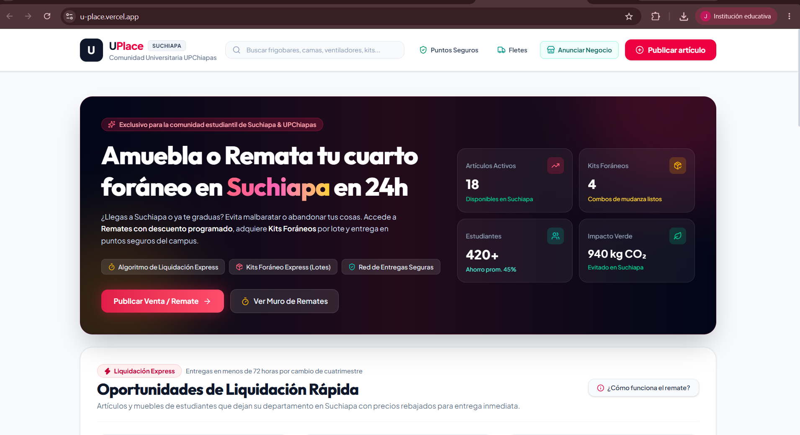
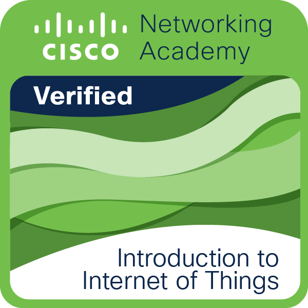
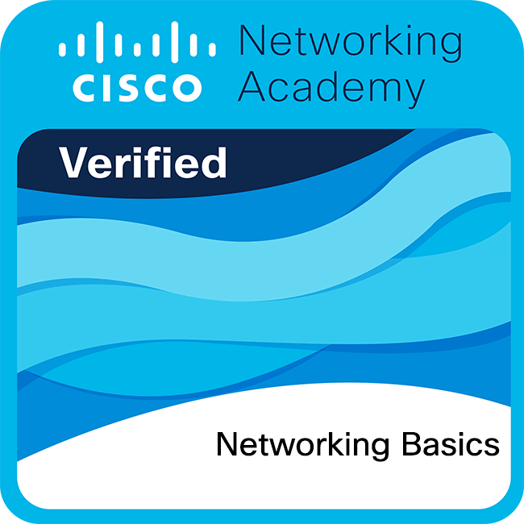
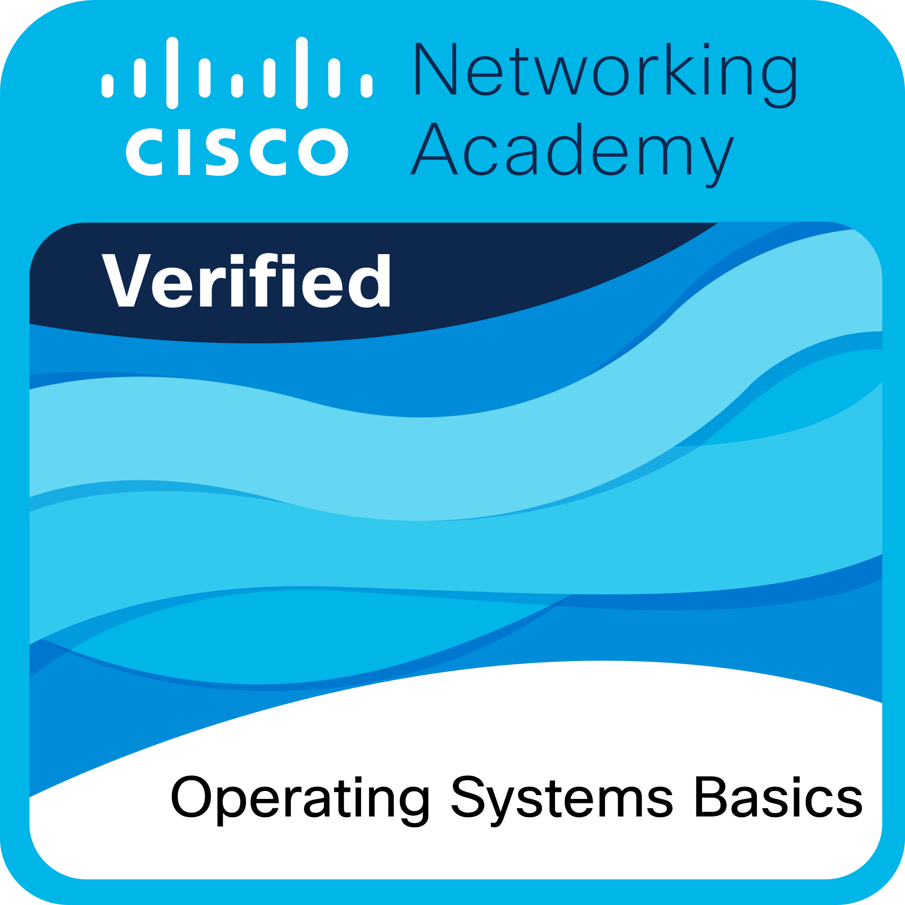

```{=html}
<div class="landing" id="inicio">
<section class="profile-card card" aria-labelledby="profile-title">
<div class="avatar-wrap"><div class="avatar"><span aria-hidden="true">JR</span></div><i class="online-dot" title="Disponible"></i></div>
<div class="profile-copy"><span class="welcome">Bienvenido a mi portafolio</span><h1 id="profile-title">Soy Jonathan Rodríguez</h1><p class="study"><span class="study-icon" aria-hidden="true"><svg viewBox="0 0 24 24" fill="none" stroke="currentColor" stroke-width="1.8"><path d="m2 9 10-5 10 5-10 5L2 9Z"/><path d="M6 11v5c3.5 2.5 8.5 2.5 12 0v-5m4-2v6"/></svg></span> Ingeniería en Tecnología de la Información e Innovación Digital · 4.º cuatrimestre · UPChiapas</p><div class="note"><strong>SOBRE MÍ</strong><p>Soy estudiante de Ingeniería en Tecnología de la Información e Innovación Digital en la UPChiapas. Me interesa crear soluciones digitales útiles y aprender en cada etapa: comprender una necesidad, colaborar con otras personas y convertir una idea en una experiencia funcional. Actualmente estoy fortaleciendo mis conocimientos en desarrollo móvil y web, y explorando la automatización. Este espacio documenta mi evolución académica y profesional, junto con los aprendizajes que construyo en cada proyecto.</p></div></div>
</section>
<section class="skills section" id="habilidades">
<div class="section-title"><h2><span class="title-icon" aria-hidden="true">▤</span> Habilidades y Tecnologías</h2><p>Stack tecnológico y herramientas utilizadas en mis proyectos.</p></div>
<div class="skill-list">
<article class="skill-card card"><div class="skill-heading"><span class="skill-icon icon-blue"></span><div><h3>Desarrollo móvil Android</h3><p>Experiencia de proyecto con Kotlin y componentes de Jetpack Compose.</p></div></div><div class="chips blue-chips"><span>Kotlin</span><span>Jetpack Compose</span><span>MVVM</span></div></article>
<article class="skill-card card"><div class="skill-heading"><span class="skill-icon icon-green"></span><div><h3>Desarrollo web</h3><p>Participación en proyectos web con tecnologías frontend actuales.</p></div></div><div class="chips green-chips"><span>HTML</span><span>CSS</span><span>JavaScript</span><span>React</span></div></article>
<article class="skill-card card"><div class="skill-heading"><span class="skill-icon icon-amber"></span><div><h3>Trabajo en proyectos</h3><p>Colaboración en equipos y participación en distintas capas de desarrollo.</p></div></div><div class="chips amber-chips"><span>Frontend</span><span>Backend</span><span>Bases de datos</span><span>Trabajo en equipo</span></div></article>
<article class="skill-card card"><div class="skill-heading"><span class="skill-icon icon-purple"></span><div><h3>Fundamentos de tecnología</h3><p>Formación inicial en nube, redes, sistemas operativos e Internet de las cosas.</p></div></div><div class="chips purple-chips"><span>Fundamentos de AWS Cloud</span><span>Redes</span><span>Sistemas operativos</span><span>IoT</span></div></article>
</div>
</section>
<section class="projects section" id="proyectos">
<div class="section-title"><h2>Proyectos desarrollados</h2><p>Experiencias de colaboración académica en desarrollo móvil y web.</p></div>
<article class="project-main card"><div class="project-media project-media-landscape"><div class="image-placeholder" hidden><span class="placeholder-mark" aria-hidden="true"><svg viewBox="0 0 24 24"><rect x="3" y="4" width="18" height="16" rx="2"/><circle cx="8.5" cy="9" r="1.5"/><path d="m4 17 5-5 3 3 3-4 5 6"/></svg></span><strong>Captura de EduControl</strong><span>Agrega tu imagen en <code>assets/images/projects/educontrol.png</code></span></div></div><div class="project-description"><div><h3>EduControl</h3><p class="project-summary">Sistema de gestión escolar · Participación full stack</p></div><p>Colaboré con el equipo en el frontend, backend y base de datos de una plataforma para la gestión escolar. Entre sus módulos están alumnos, evaluaciones, registros, calificaciones, grupos y reportes. El proyecto se desarrolló con HTML, CSS y JavaScript.</p><div class="chips blue-chips"><span>HTML</span><span>CSS</span><span>JavaScript</span><span>Frontend</span><span>Backend</span><span>Base de datos</span></div><a class="project-button" href="https://github.com/JonnySDE/EduControl" target="_blank" rel="noopener noreferrer">Ver repositorio en GitHub <span aria-hidden="true">→</span></a></div></article>
<h3 class="subhead">Otros Proyectos Destacados</h3>
<div class="other-projects">
<article class="other-card card"><div class="project-media project-media-phone"><div class="image-placeholder" hidden><span class="placeholder-mark" aria-hidden="true"><svg viewBox="0 0 24 24"><rect x="3" y="4" width="18" height="16" rx="2"/><circle cx="8.5" cy="9" r="1.5"/><path d="m4 17 5-5 3 3 3-4 5 6"/></svg></span><strong>Captura de Home Score</strong><span><code>assets/images/projects/homeScore.jpeg</code></span></div></div><div class="other-project-heading"><span class="mini-icon icon-blue" aria-hidden="true"></span><div><p class="eyebrow">DESARROLLO MÓVIL · ANDROID</p><h3>Home Score</h3></div></div><p>Aplicación móvil que ayuda a explorar si una vivienda se ajusta a la situación financiera de una persona. Participé en el equipo de desarrollo con Kotlin, Jetpack Compose y arquitectura MVVM.</p><div class="chips"><span>Kotlin</span><span>Jetpack Compose</span><span>MVVM</span></div><a href="https://github.com/JonnySDE/HomeScore" target="_blank" rel="noopener noreferrer">Ver repositorio en GitHub <span aria-hidden="true">→</span></a></article>
<article class="other-card card"><div class="project-media project-media-small project-media-landscape"><div class="image-placeholder" hidden><span class="placeholder-mark" aria-hidden="true"><svg viewBox="0 0 24 24"><rect x="3" y="4" width="18" height="16" rx="2"/><circle cx="8.5" cy="9" r="1.5"/><path d="m4 17 5-5 3 3 3-4 5 6"/></svg></span><strong>Captura de UPlace</strong><span><code>assets/images/projects/uplace.png</code></span></div></div><div class="other-project-heading"><span class="mini-icon icon-green" aria-hidden="true"></span><div><p class="eyebrow">DESARROLLO WEB · REACT</p><h3>UPlace</h3></div></div><p>Plataforma web para la comunidad universitaria de UPChiapas. Colaboré con el equipo en su desarrollo con React. La propuesta reúne publicaciones de estudiantes, remates de artículos, kits para foráneos y opciones de entrega segura dentro de la comunidad.</p><div class="chips"><span>React</span><span>Comunidad universitaria</span><span>Trabajo en equipo</span></div><a href="https://github.com/JonnySDE/UPlace" target="_blank" rel="noopener noreferrer">Ver repositorio en GitHub <span aria-hidden="true">→</span></a></article>
</div>
</section>
<section class="certifications section" id="certificaciones">
<div class="section-title"><h2>Certificaciones y Credenciales</h2><p>Insignias y cursos completados durante mi formación académica.</p></div>
<div class="credential-list">
<article class="credential-card card"><div class="credential-head"><div class="badge badge-blue"></div><div class="credential-copy"><h3>AWS Academy Cloud Foundations</h3><p class="issuer">AWS Academy · Insignia de formación</p><p class="credential-date"><span>Completado</span><time datetime="2025-11-21">21 de noviembre de 2025</time></p></div></div><div class="credential-details"><h4>Lo que aprendí</h4><ul><li>Conceptos esenciales de computación en la nube.</li><li>Servicios principales de AWS y sus usos.</li><li>Fundamentos de seguridad, arquitectura, costos y soporte.</li></ul></div></article>
<article class="credential-card card"><div class="credential-head"><div class="badge badge-green"></div><div class="credential-copy"><h3>Introduction to the Internet of Things</h3><p class="issuer">Cisco Networking Academy · Insignia</p><p class="credential-date"><span>Completado</span><time datetime="2025-11-05">5 de noviembre de 2025</time></p></div></div><div class="credential-details"><h4>Lo que aprendí</h4><ul><li>Cómo se conectan los dispositivos IoT a una red.</li><li>La relación entre el Internet de las cosas y la transformación digital.</li><li>Conceptos introductorios de programación, datos y seguridad en soluciones conectadas.</li></ul></div></article>
<article class="credential-card card"><div class="credential-head"><div class="badge badge-amber"></div><div class="credential-copy"><h3>Networking Basics</h3><p class="issuer">Cisco Networking Academy · Insignia</p><p class="credential-date"><span>Completado</span><time datetime="2025-10-30">30 de octubre de 2025</time></p></div></div><div class="credential-details"><h4>Lo que aprendí</h4><ul><li>La función de los dispositivos, medios y protocolos de red.</li><li>Cómo las direcciones IP permiten la comunicación entre equipos.</li><li>Fundamentos para conectar dispositivos y crear una red local básica.</li></ul></div></article>
<article class="credential-card card"><div class="credential-head"><div class="badge badge-purple"></div><div class="credential-copy"><h3>Operating Systems Basics</h3><p class="issuer">Cisco Networking Academy · Insignia</p><p class="credential-date"><span>Completado</span><time datetime="2026-02-11">11 de febrero de 2026</time></p></div></div><div class="credential-details"><h4>Lo que aprendí</h4><ul><li>Propósito y funciones esenciales de Windows, Linux y sistemas móviles.</li><li>Uso inicial de la terminal y el sistema de archivos de Linux.</li><li>Nociones de seguridad y conectividad en dispositivos móviles.</li></ul></div></article>
</div>
</section>
<section class="contact section" id="contacto">
<div class="section-title"><h2>Redes y Contacto</h2><p>Conecta conmigo y revisa mis repositorios de código abierto.</p></div>
<div class="social-grid">
<a class="social-card card" href="https://github.com/JonnySDE" target="_blank" rel="noopener noreferrer" aria-label="Abrir GitHub de Jonathan Rodríguez"><span class="social-icon brand-github" aria-hidden="true"><svg viewBox="0 0 24 24"><path d="M12 .8a11.2 11.2 0 0 0-3.54 21.83c.56.1.76-.24.76-.54v-2.1c-3.1.68-3.75-1.32-3.75-1.32-.51-1.29-1.25-1.63-1.25-1.63-1.02-.7.08-.69.08-.69 1.13.08 1.72 1.16 1.72 1.16 1 1.72 2.62 1.22 3.26.93.1-.73.39-1.23.71-1.51-2.48-.28-5.09-1.24-5.09-5.52 0-1.22.43-2.21 1.16-2.99-.12-.28-.5-1.42.11-2.96 0 0 .95-.3 3.08 1.14a10.7 10.7 0 0 1 5.6 0c2.13-1.44 3.08-1.14 3.08-1.14.61 1.54.23 2.68.11 2.96.72.78 1.16 1.77 1.16 2.99 0 4.29-2.62 5.23-5.11 5.51.4.35.76 1.03.76 2.08v3.09c0 .3.2.65.77.54A11.2 11.2 0 0 0 12 .8Z"/></svg></span><span><b>GITHUB</b><small>github.com/JonnySDE</small></span><span class="arrow" aria-hidden="true">↗</span></a>
<a class="social-card card" href="https://www.linkedin.com/in/jonathan-rodr%C3%ADguez-cabrera-ba8486435/" target="_blank" rel="noopener noreferrer" aria-label="Abrir LinkedIn de Jonathan Rodríguez"><span class="social-icon brand-linkedin" aria-hidden="true"><svg viewBox="0 0 24 24"><path d="M5.2 3.1a2.1 2.1 0 1 0 0 4.2 2.1 2.1 0 0 0 0-4.2ZM3.4 9h3.6v11.7H3.4V9Zm5.8 0h3.4v1.6h.1a3.8 3.8 0 0 1 3.4-1.9c3.6 0 4.3 2.4 4.3 5.5v6.5h-3.6v-5.8c0-1.4 0-3.2-1.9-3.2s-2.2 1.5-2.2 3.1v5.9H9.2V9Z"/></svg></span><span><b>LINKEDIN</b><small>linkedin.com/in/jonathan-rodríguez-cabrera</small></span><span class="arrow" aria-hidden="true">↗</span></a>
<a class="social-card card" href="https://www.instagram.com/jonathan_rodrgzz/" target="_blank" rel="noopener noreferrer" aria-label="Abrir Instagram de Jonathan Rodríguez"><span class="social-icon brand-instagram" aria-hidden="true"><svg viewBox="0 0 24 24"><rect x="3" y="3" width="18" height="18" rx="5"/><circle cx="12" cy="12" r="4"/><circle class="instagram-dot" cx="17.6" cy="6.6" r="1"/></svg></span><span><b>INSTAGRAM</b><small>@jonathan_rodrgzz</small></span><span class="arrow" aria-hidden="true">↗</span></a>
<a class="social-card card" href="https://mail.google.com/mail/?view=cm&amp;fs=1&amp;to=jonathanrodriguezcabrera1811%40gmail.com" target="_blank" rel="noopener noreferrer" aria-label="Escribir a Jonathan por Gmail"><span class="social-icon brand-gmail" aria-hidden="true"><svg viewBox="0 0 48 40"><path d="M7 11v23" fill="none" stroke="#4285F4" stroke-width="5" stroke-linecap="round"/><path d="M41 11v23" fill="none" stroke="#34A853" stroke-width="5" stroke-linecap="round"/><path d="m7 12 17 13 17-13" fill="none" stroke="#EA4335" stroke-width="5" stroke-linecap="round" stroke-linejoin="round"/><path d="M9 34h30" fill="none" stroke="#FBBC04" stroke-width="4" stroke-linecap="round"/></svg></span><span><b>GMAIL</b><small>jonathanrodriguezcabrera1811@gmail.com</small></span><span class="arrow" aria-hidden="true">↗</span></a>
</div>
<form class="contact-form card" id="contact-form"><h3>Envíame un mensaje</h3><p>¿Tienes un proyecto o propuesta sobre algún proyecto? Escríbeme.</p><label for="name">Nombre Completo</label><input id="name" name="name" autocomplete="name" placeholder="Tu nombre..." required><label for="email">Correo Electrónico</label><input id="email" name="email" type="email" autocomplete="email" placeholder="ejemplo@correo.com" required><label for="subject">Asunto / Proyecto de interés</label><input id="subject" name="subject" placeholder="Selecciona o escribe el motivo..." required><label for="message">Mensaje</label><textarea id="message" name="message" placeholder="Escribe tu mensaje aquí..." required></textarea><button type="submit">Enviar Mensaje Directo <span>→</span></button><p class="form-note" id="form-note" aria-live="polite">Gmail abrirá un borrador. Revisa el mensaje y pulsa Enviar.</p></form>
</section>
</div>
<footer class="site-footer"><div class="footer-inner"><div class="footer-brand"><strong>Jonathan Rodríguez</strong><span>Estudiante de Ingeniería en Tecnología de la Información e Innovación Digital · UPChiapas</span></div><div class="footer-social"><a href="https://github.com/JonnySDE" target="_blank" rel="noopener noreferrer" aria-label="GitHub"><svg viewBox="0 0 24 24" aria-hidden="true"><path d="M12 .8a11.2 11.2 0 0 0-3.54 21.83c.56.1.76-.24.76-.54v-2.1c-3.1.68-3.75-1.32-3.75-1.32-.51-1.29-1.25-1.63-1.25-1.63-1.02-.7.08-.69.08-.69 1.13.08 1.72 1.16 1.72 1.16 1 1.72 2.62 1.22 3.26.93.1-.73.39-1.23.71-1.51-2.48-.28-5.09-1.24-5.09-5.52 0-1.22.43-2.21 1.16-2.99-.12-.28-.5-1.42.11-2.96 0 0 .95-.3 3.08 1.14a10.7 10.7 0 0 1 5.6 0c2.13-1.44 3.08-1.14 3.08-1.14.61 1.54.23 2.68.11 2.96.72.78 1.16 1.77 1.16 2.99 0 4.29-2.62 5.23-5.11 5.51.4.35.76 1.03.76 2.08v3.09c0 .3.2.65.77.54A11.2 11.2 0 0 0 12 .8Z"/></svg></a><a href="https://www.linkedin.com/in/jonathan-rodr%C3%ADguez-cabrera-ba8486435/" target="_blank" rel="noopener noreferrer" aria-label="LinkedIn"><svg viewBox="0 0 24 24" aria-hidden="true"><path d="M5.2 3.1a2.1 2.1 0 1 0 0 4.2 2.1 2.1 0 0 0 0-4.2ZM3.4 9h3.6v11.7H3.4V9Zm5.8 0h3.4v1.6h.1a3.8 3.8 0 0 1 3.4-1.9c3.6 0 4.3 2.4 4.3 5.5v6.5h-3.6v-5.8c0-1.4 0-3.2-1.9-3.2s-2.2 1.5-2.2 3.1v5.9H9.2V9Z"/></svg></a><a href="https://www.instagram.com/jonathan_rodrgzz/" target="_blank" rel="noopener noreferrer" aria-label="Instagram"><svg viewBox="0 0 24 24" aria-hidden="true"><rect x="3" y="3" width="18" height="18" rx="5"/><circle cx="12" cy="12" r="4"/><circle cx="17.6" cy="6.6" r="1"/></svg></a></div></div><div class="footer-rule"></div><div class="footer-meta"><span>© 2026 Jonathan Rodríguez. Todos los derechos reservados.</span><a href="#inicio">Volver arriba ↑</a></div></footer>
<script>
document.getElementById('contact-form').addEventListener('submit', function (event) {
event.preventDefault();
const form = new FormData(event.currentTarget);
const recipient = 'jonathanrodriguezcabrera1811@gmail.com';
const params = new URLSearchParams({
view: 'cm',
fs: '1',
to: recipient,
su: form.get('subject'),
body: `Nombre: ${form.get('name')}\nCorreo: ${form.get('email')}\n\n${form.get('message')}`
});
document.getElementById('form-note').textContent = 'Abriendo un borrador en Gmail…';
window.open(`https://mail.google.com/mail/?${params.toString()}`, '_blank', 'noopener,noreferrer');
});
</script>
```


