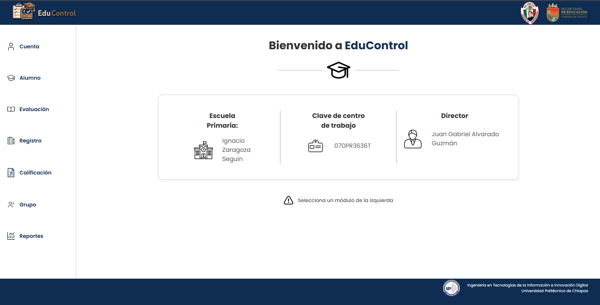

```{=html}
<div class="blog-shell"><nav class="blog-nav" aria-label="Navegación del blog"><a class="blog-brand" href="../blog/index.html"><span class="brand-mark">&lt;/&gt;</span><strong>Jona<span>Blog</span></strong></a><div class="blog-links"><a href="../blog/index.html">Inicio</a><a class="active" href="../blog/articulos.html">Artículos</a><a href="../blog/categorias.html">Categorías</a><a href="../blog/social.html">Social Media</a></div><a class="back-link" href="../index.html">Volver al portafolio</a></nav><main class="article-main"><header class="article-heading"><span class="eyebrow-label">CASO DE PROYECTO · DESARROLLO WEB</span><h1>EduControl: colaborar en un sistema para la gestión escolar</h1><div class="article-meta"><span>Jonathan Rodríguez</span><span>5 de octubre de 2026</span><span>3 min de lectura</span></div></header>
```

```{=html}
<div class="article-cover"><span>CASO DE PROYECTO · DESARROLLO WEB</span></div>
```

EduControl fue uno de los proyectos académicos en los que pude acercarme a distintas partes del desarrollo de software. Colaboré con el equipo en el frontend, el backend y la base de datos, usando HTML, CSS y JavaScript.

El objetivo del sistema es apoyar la gestión escolar. En la interfaz del proyecto se organizan áreas como alumnos, evaluaciones, registros, calificaciones, grupos y reportes. Ver esas secciones reunidas en una misma plataforma me ayudó a entender mejor cómo una aplicación puede dar estructura a tareas que forman parte del trabajo cotidiano de una escuela.

```{=html}
<div class="article-pillars" aria-label="Áreas en las que participé"><div><span>01</span><strong>Frontend</strong><small>Interfaz y experiencia visible</small></div><div><span>02</span><strong>Backend</strong><small>Lógica de la aplicación</small></div><div><span>03</span><strong>Base de datos</strong><small>Organización de información</small></div></div>
```

## Del problema a una experiencia de uso

En un sistema escolar, la claridad importa tanto como las funciones. La persona que lo usa necesita ubicar con facilidad el área que busca y entender qué información está consultando. Por eso, trabajar en una plataforma con distintos módulos me hizo pensar en cómo se presenta cada parte y cómo se relaciona con las demás.

Mi participación tocó varias capas del proyecto. En el frontend colaboré con la experiencia que ve la persona usuaria; en el backend, con la lógica que conecta esa interfaz con las operaciones del sistema; y en la base de datos, con la organización de la información que la aplicación necesita manejar. Esta visión amplia me permitió apreciar que cada capa depende de las otras para que el producto funcione como un conjunto.

```{=html}
<figure class="article-figure"><figcaption>Vista del proyecto EduControl. La plataforma reúne distintas áreas de gestión escolar.</figcaption></figure>
```

## Lo que me dejó el trabajo en equipo

Colaborar en un proyecto que abarca varias capas también significa mantener comunicación y conectar el trabajo de cada persona. Un cambio en la interfaz puede requerir información distinta; una modificación en la estructura de datos puede influir en cómo se presenta una sección. Esta relación me ayudó a mirar más allá de una sola pantalla.

También me permitió practicar una forma de trabajo más completa: comprender cómo se conectan las partes, revisar el resultado en contexto y pensar en la utilidad del sistema para quienes lo usarían. Es una experiencia que fortaleció mi interés por seguir aprendiendo desarrollo web y por participar en proyectos donde la tecnología resuelve necesidades concretas.

## Lo que aprendí

- Un sistema con varios módulos necesita una organización comprensible para que la información sea fácil de encontrar.
- Las interfaces, la lógica del servidor y la base de datos forman partes relacionadas de una misma solución.
- En un proyecto colaborativo, compartir contexto entre las distintas áreas ayuda a construir una experiencia coherente.
- Revisar el producto desde el punto de vista de quien lo utilizará cambia la manera de evaluar una función.

## Una experiencia que quiero seguir ampliando

EduControl fue una oportunidad para participar en diferentes áreas y entender mejor el recorrido de una aplicación web. Me llevo la práctica de trabajar en equipo y la motivación de continuar fortaleciendo mis bases para crear herramientas claras, útiles y bien conectadas.

[Consultar el repositorio de EduControl en GitHub](https://github.com/JonnySDE/EduControl)

```{=html}
<aside class="article-takeaway"><span class="takeaway-label">IDEA CLAVE</span><strong>Una aplicación escolar no es solo un conjunto de pantallas: es una experiencia que conecta información, procesos y personas.</strong></aside>
<nav class="article-pagination" aria-label="Navegación entre artículos"><a href="uplace.html"><small>ARTÍCULO ANTERIOR</small><strong>UPlace: una plataforma para la comunidad universitaria ←</strong></a><a href="home-score.html"><small>ARTÍCULO SIGUIENTE</small><strong>Home Score: pensar la compra de vivienda →</strong></a></nav>
<section class="related-reading"><h2>Seguir leyendo</h2><a href="home-score.html">Home Score <span>Kotlin · Desarrollo móvil</span></a><a href="uplace.html">UPlace <span>React · Desarrollo web</span></a></section>
</main><footer class="blog-footer"><div class="blog-footer-inner"><div><strong>Jonathan Rodríguez</strong><p>Estudiante de Ingeniería en Tecnología de la Información e Innovación Digital · UPChiapas</p></div><div class="blog-footer-links"><a href="https://github.com/JonnySDE" target="_blank" rel="noopener noreferrer" aria-label="GitHub" title="GitHub"><svg viewBox="0 0 24 24" aria-hidden="true" focusable="false"><path d="M12 .8a11.2 11.2 0 0 0-3.54 21.83c.56.1.76-.24.76-.54v-2.1c-3.1.68-3.75-1.32-3.75-1.32-.51-1.29-1.25-1.63-1.25-1.63-1.02-.7.08-.69.08-.69 1.13.08 1.72 1.16 1.72 1.16 1 1.72 2.62 1.22 3.26.93.1-.73.39-1.23.71-1.51-2.48-.28-5.09-1.24-5.09-5.52 0-1.22.43-2.21 1.16-2.99-.12-.28-.5-1.42.11-2.96 0 0 .95-.3 3.08 1.14a10.7 10.7 0 0 1 5.6 0c2.13-1.44 3.08-1.14 3.08-1.14.61 1.54.23 2.68.11 2.96.72.78 1.16 1.77 1.16 2.99 0 4.29-2.62 5.23-5.11 5.51.4.35.76 1.03.76 2.08v3.09c0 .3.2.65.77.54A11.2 11.2 0 0 0 12 .8Z"/></svg></a><a href="https://www.linkedin.com/in/jonathan-rodr%C3%ADguez-cabrera-ba8486435/" target="_blank" rel="noopener noreferrer" aria-label="LinkedIn" title="LinkedIn"><svg viewBox="0 0 24 24" aria-hidden="true" focusable="false"><path d="M5.2 3.1a2.1 2.1 0 1 0 0 4.2 2.1 2.1 0 0 0 0-4.2ZM3.4 9h3.6v11.7H3.4V9Zm5.8 0h3.4v1.6h.1a3.8 3.8 0 0 1 3.4-1.9c3.6 0 4.3 2.4 4.3 5.5v6.5h-3.6v-5.8c0-1.4 0-3.2-1.9-3.2s-2.2 1.5-2.2 3.1v5.9H9.2V9Z"/></svg></a><a href="https://www.instagram.com/jonathan_rodrgzz/" target="_blank" rel="noopener noreferrer" aria-label="Instagram" title="Instagram"><svg viewBox="0 0 24 24" aria-hidden="true" focusable="false"><rect x="3" y="3" width="18" height="18" rx="5"/><circle cx="12" cy="12" r="4"/><circle class="instagram-dot" cx="17.6" cy="6.6" r="1"/></svg></a></div></div><div class="blog-footer-bottom">© 2026 Jonathan Rodríguez · JonaBlog</div></footer></div>
```
