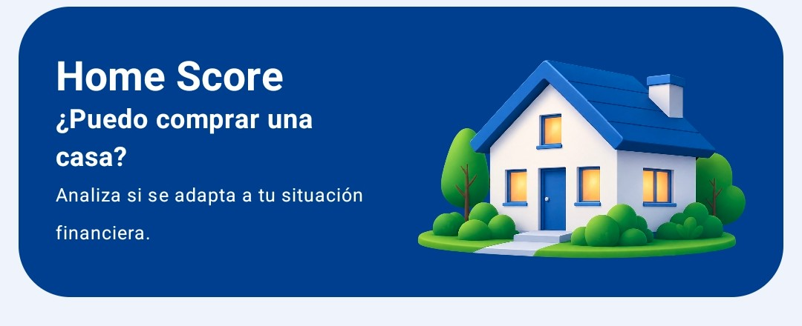
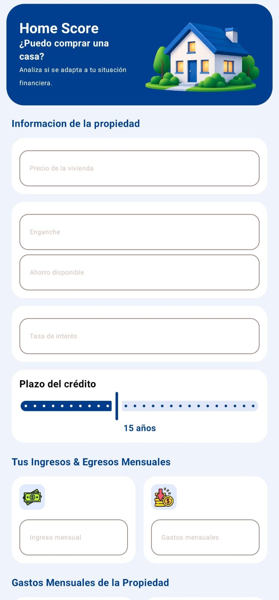

```{=html}
<div class="blog-shell"><nav class="blog-nav" aria-label="Navegación del blog"><a class="blog-brand" href="../blog/index.html"><span class="brand-mark">&lt;/&gt;</span><strong>Jona<span>Blog</span></strong></a><div class="blog-links"><a href="../blog/index.html">Inicio</a><a class="active" href="../blog/articulos.html">Artículos</a><a href="../blog/categorias.html">Categorías</a><a href="../blog/social.html">Social Media</a></div><a class="back-link" href="../index.html">Volver al portafolio</a></nav><main class="article-main"><header class="article-heading"><span class="eyebrow-label">KOTLIN · DESARROLLO MÓVIL</span><h1>Home Score: explorar si una vivienda se ajusta a tus posibilidades</h1><div class="article-meta"><span>Jonathan Rodríguez</span><span>5 de octubre de 2026</span><span>3 min de lectura</span></div></header>
```

```{=html}
<div class="article-cover"><span>CASO DE PROYECTO · ANDROID</span></div>
```

Home Score es una aplicación móvil pensada para ayudar a explorar una pregunta importante: ¿una vivienda podría ajustarse a la situación financiera de una persona? Formé parte del equipo que desarrolló el proyecto con Kotlin, Jetpack Compose y una arquitectura MVVM.

La captura de la aplicación muestra el tipo de información que se pone en contexto: precio de la vivienda, enganche, ahorro disponible y datos relacionados con ingresos y gastos. Presentar estos campos de forma ordenada es importante porque la persona necesita entender qué datos está proporcionando y cómo se relacionan con su consulta.

```{=html}
<div class="article-data-grid" aria-label="Datos que aparecen en Home Score"><span>Precio de vivienda</span><span>Enganche</span><span>Ahorro disponible</span><span>Ingresos y gastos</span><span>Tasa de interés</span><span>Plazo</span></div>
```

## Diseñar para una pregunta real

Hablar de la compra de una vivienda puede sentirse complejo. Una aplicación que aborda este tema debe ayudar a organizar la información para que resulte más fácil explorarla. Home Score parte de esa necesidad: reunir datos que una persona puede considerar al evaluar una vivienda y presentarlos desde un dispositivo móvil.

El proyecto no sustituye la asesoría financiera ni una evaluación profesional. Su valor está en ofrecer una herramienta de exploración dentro del alcance definido por el equipo. Esta distinción también forma parte de diseñar con responsabilidad: explicar con claridad qué ayuda a hacer una aplicación y evitar prometer resultados que no puede garantizar.

```{=html}
<figure class="article-figure article-figure-phone"><figcaption>La vista móvil organiza los datos de la vivienda y la situación financiera en un formato vertical.</figcaption></figure>
```

## Una experiencia construida para móvil

En una aplicación Android, la información se recorre en una pantalla más estrecha y alta que la de un sitio web de escritorio. La captura de Home Score refleja ese formato: los datos aparecen en una columna vertical y pueden consultarse a medida que se avanza por la pantalla.

El proyecto se desarrolló con Kotlin y Jetpack Compose, dentro de una arquitectura MVVM. Como integrante del equipo, participar en este trabajo me permitió conocer mejor el desarrollo móvil y observar cómo la elección de herramientas y la organización del proyecto acompañan la construcción de una aplicación.

## Lo que me llevo del proyecto

- La disposición de los campos influye en qué tan sencillo resulta completar una consulta.
- En móvil, la lectura vertical y el espacio disponible deben considerarse desde el diseño de cada pantalla.
- Kotlin y Jetpack Compose formaron parte de la implementación Android del proyecto.
- MVVM fue la arquitectura utilizada para organizar la aplicación.
- En equipo, acordar cómo se presenta la información ayuda a que distintas partes de la app mantengan una experiencia consistente.

## Seguir aprendiendo desde la práctica

Home Score me acercó a un problema cotidiano desde el desarrollo móvil. La experiencia reforzó mi interés por profundizar en Android, seguir practicando Kotlin y aprender a construir aplicaciones que presenten información de manera clara.

[Consultar el repositorio de Home Score en GitHub](https://github.com/JonnySDE/HomeScore)

```{=html}
<aside class="article-takeaway"><span class="takeaway-label">IDEA CLAVE</span><strong>Una herramienta útil puede ayudar a ordenar una decisión compleja, siempre dejando claro el alcance de lo que ofrece.</strong></aside>
<nav class="article-pagination" aria-label="Navegación entre artículos"><a href="educontrol.html"><small>ARTÍCULO ANTERIOR</small><strong>EduControl: colaborar en un sistema escolar ←</strong></a><a href="uplace.html"><small>ARTÍCULO SIGUIENTE</small><strong>UPlace: una plataforma para la comunidad →</strong></a></nav>
<section class="related-reading"><h2>Seguir leyendo</h2><a href="uplace.html">UPlace <span>React · Desarrollo web</span></a><a href="educontrol.html">EduControl <span>Caso de proyecto</span></a></section>
</main><footer class="blog-footer"><div class="blog-footer-inner"><div><strong>Jonathan Rodríguez</strong><p>Estudiante de Ingeniería en Tecnología de la Información e Innovación Digital · UPChiapas</p></div><div class="blog-footer-links"><a href="https://github.com/JonnySDE" target="_blank" rel="noopener noreferrer" aria-label="GitHub" title="GitHub"><svg viewBox="0 0 24 24" aria-hidden="true" focusable="false"><path d="M12 .8a11.2 11.2 0 0 0-3.54 21.83c.56.1.76-.24.76-.54v-2.1c-3.1.68-3.75-1.32-3.75-1.32-.51-1.29-1.25-1.63-1.25-1.63-1.02-.7.08-.69.08-.69 1.13.08 1.72 1.16 1.72 1.16 1 1.72 2.62 1.22 3.26.93.1-.73.39-1.23.71-1.51-2.48-.28-5.09-1.24-5.09-5.52 0-1.22.43-2.21 1.16-2.99-.12-.28-.5-1.42.11-2.96 0 0 .95-.3 3.08 1.14a10.7 10.7 0 0 1 5.6 0c2.13-1.44 3.08-1.14 3.08-1.14.61 1.54.23 2.68.11 2.96.72.78 1.16 1.77 1.16 2.99 0 4.29-2.62 5.23-5.11 5.51.4.35.76 1.03.76 2.08v3.09c0 .3.2.65.77.54A11.2 11.2 0 0 0 12 .8Z"/></svg></a><a href="https://www.linkedin.com/in/jonathan-rodr%C3%ADguez-cabrera-ba8486435/" target="_blank" rel="noopener noreferrer" aria-label="LinkedIn" title="LinkedIn"><svg viewBox="0 0 24 24" aria-hidden="true" focusable="false"><path d="M5.2 3.1a2.1 2.1 0 1 0 0 4.2 2.1 2.1 0 0 0 0-4.2ZM3.4 9h3.6v11.7H3.4V9Zm5.8 0h3.4v1.6h.1a3.8 3.8 0 0 1 3.4-1.9c3.6 0 4.3 2.4 4.3 5.5v6.5h-3.6v-5.8c0-1.4 0-3.2-1.9-3.2s-2.2 1.5-2.2 3.1v5.9H9.2V9Z"/></svg></a><a href="https://www.instagram.com/jonathan_rodrgzz/" target="_blank" rel="noopener noreferrer" aria-label="Instagram" title="Instagram"><svg viewBox="0 0 24 24" aria-hidden="true" focusable="false"><rect x="3" y="3" width="18" height="18" rx="5"/><circle cx="12" cy="12" r="4"/><circle class="instagram-dot" cx="17.6" cy="6.6" r="1"/></svg></a></div></div><div class="blog-footer-bottom">© 2026 Jonathan Rodríguez · JonaBlog</div></footer></div>
```
