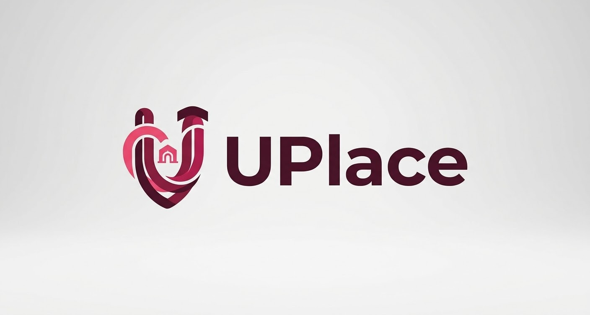

```{=html}
<div class="blog-shell"><nav class="blog-nav" aria-label="Navegación del blog"><a class="blog-brand" href="../blog/index.html"><span class="brand-mark">&lt;/&gt;</span><strong>Jona<span>Blog</span></strong></a><div class="blog-links"><a href="../blog/index.html">Inicio</a><a class="active" href="../blog/articulos.html">Artículos</a><a href="../blog/categorias.html">Categorías</a><a href="../blog/social.html">Social Media</a></div><a class="back-link" href="../index.html">Volver al portafolio</a></nav><main class="article-main"><header class="article-heading"><span class="eyebrow-label">REACT · DESARROLLO WEB</span><h1>UPlace: construir una plataforma para la comunidad universitaria</h1><div class="article-meta"><span>Jonathan Rodríguez</span><span>5 de octubre de 2026</span><span>3 min de lectura</span></div></header>
```

```{=html}
<div class="article-cover"><span>CASO DE PROYECTO · DESARROLLO WEB</span></div>
```

UPlace es una plataforma web pensada para la comunidad universitaria de UPChiapas. Formé parte del equipo que desarrolló la experiencia con React. La propuesta reúne publicaciones de estudiantes, artículos en remate, kits para personas foráneas y opciones de entrega segura dentro de la comunidad.

La idea resulta cercana a la vida universitaria: facilitar que las personas encuentren artículos y oportunidades compartidas por otras personas de su entorno. La página principal presenta esa intención desde el inicio, con una vista que destaca el propósito de la plataforma y organiza distintos tipos de contenido.

```{=html}
<div class="article-pillars uplace-pillars" aria-label="Contenido destacado de UPlace"><div><span>01</span><strong>Publicaciones</strong><small>Artículos compartidos entre estudiantes</small></div><div><span>02</span><strong>Remates</strong><small>Oportunidades dentro de la comunidad</small></div><div><span>03</span><strong>Vida universitaria</strong><small>Kits para foráneos y puntos de entrega segura</small></div></div>
```

## Una plataforma alrededor de su comunidad

Al trabajar en un producto dirigido a estudiantes, es importante que la experiencia haga visible para quién existe y qué puede encontrar allí. En UPlace, la comunidad universitaria es el punto de encuentro: publicaciones y artículos compartidos cobran sentido porque conectan necesidades e intereses de personas que forman parte del mismo espacio.

La captura muestra diferentes áreas de contenido, incluidas oportunidades de remate y elementos pensados para quienes llegan a la región. También aparecen opciones de entrega segura. En conjunto, estas secciones comunican una propuesta amplia sin limitar la plataforma a un único tipo de publicación.

```{=html}
<figure class="article-figure"><figcaption>La portada presenta UPlace como un espacio para compartir publicaciones y oportunidades dentro de la comunidad.</figcaption></figure>
```

## Mi experiencia en el equipo

Participé en el desarrollo junto con el equipo, utilizando React. Trabajar en una plataforma de este tipo me permitió acercarme a la construcción de interfaces web pensadas para presentar información de forma clara y dar contexto a distintas secciones.

También me ayudó a valorar el proceso colaborativo. Una idea puede crecer cuando cada integrante aporta desde su perspectiva y el equipo mantiene una dirección común. Para mí, UPlace fue una oportunidad de aplicar lo que voy aprendiendo en un producto conectado con la experiencia cotidiana de la comunidad universitaria.

## Lo que aprendí

- El público al que se dirige un producto debe notarse en su contenido y en la manera en que organiza la información.
- Una portada puede comunicar con claridad el propósito y las posibilidades principales de una plataforma.
- React fue la tecnología elegida para construir la experiencia web de UPlace.
- El trabajo en equipo permite reunir aportaciones para dar forma a una propuesta compartida.
- Diseñar para una comunidad implica considerar diferentes necesidades y tipos de contenido.

## Una idea con espacio para crecer

UPlace me dejó una experiencia práctica de colaboración en desarrollo web y una referencia concreta de cómo una plataforma puede vincular necesidades de una comunidad. Quiero seguir ampliando mis habilidades con React y participar en más proyectos donde la experiencia digital tenga un propósito cercano a las personas.

[Consultar el repositorio de UPlace en GitHub](https://github.com/JonnySDE/UPlace)

```{=html}
<aside class="article-takeaway"><span class="takeaway-label">IDEA CLAVE</span><strong>Las plataformas comunitarias funcionan mejor cuando su propósito y las personas a quienes sirven se entienden desde el primer vistazo.</strong></aside>
<nav class="article-pagination" aria-label="Navegación entre artículos"><a href="home-score.html"><small>ARTÍCULO ANTERIOR</small><strong>Home Score: explorar la compra de vivienda ←</strong></a><a href="educontrol.html"><small>ARTÍCULO SIGUIENTE</small><strong>EduControl: un sistema para la gestión escolar →</strong></a></nav>
<section class="related-reading"><h2>Seguir leyendo</h2><a href="home-score.html">Home Score <span>Kotlin · Desarrollo móvil</span></a><a href="educontrol.html">EduControl <span>Caso de proyecto</span></a></section>
</main><footer class="blog-footer"><div class="blog-footer-inner"><div><strong>Jonathan Rodríguez</strong><p>Estudiante de Ingeniería en Tecnología de la Información e Innovación Digital · UPChiapas</p></div><div class="blog-footer-links"><a href="https://github.com/JonnySDE" target="_blank" rel="noopener noreferrer" aria-label="GitHub" title="GitHub"><svg viewBox="0 0 24 24" aria-hidden="true" focusable="false"><path d="M12 .8a11.2 11.2 0 0 0-3.54 21.83c.56.1.76-.24.76-.54v-2.1c-3.1.68-3.75-1.32-3.75-1.32-.51-1.29-1.25-1.63-1.25-1.63-1.02-.7.08-.69.08-.69 1.13.08 1.72 1.16 1.72 1.16 1 1.72 2.62 1.22 3.26.93.1-.73.39-1.23.71-1.51-2.48-.28-5.09-1.24-5.09-5.52 0-1.22.43-2.21 1.16-2.99-.12-.28-.5-1.42.11-2.96 0 0 .95-.3 3.08 1.14a10.7 10.7 0 0 1 5.6 0c2.13-1.44 3.08-1.14 3.08-1.14.61 1.54.23 2.68.11 2.96.72.78 1.16 1.77 1.16 2.99 0 4.29-2.62 5.23-5.11 5.51.4.35.76 1.03.76 2.08v3.09c0 .3.2.65.77.54A11.2 11.2 0 0 0 12 .8Z"/></svg></a><a href="https://www.linkedin.com/in/jonathan-rodr%C3%ADguez-cabrera-ba8486435/" target="_blank" rel="noopener noreferrer" aria-label="LinkedIn" title="LinkedIn"><svg viewBox="0 0 24 24" aria-hidden="true" focusable="false"><path d="M5.2 3.1a2.1 2.1 0 1 0 0 4.2 2.1 2.1 0 0 0 0-4.2ZM3.4 9h3.6v11.7H3.4V9Zm5.8 0h3.4v1.6h.1a3.8 3.8 0 0 1 3.4-1.9c3.6 0 4.3 2.4 4.3 5.5v6.5h-3.6v-5.8c0-1.4 0-3.2-1.9-3.2s-2.2 1.5-2.2 3.1v5.9H9.2V9Z"/></svg></a><a href="https://www.instagram.com/jonathan_rodrgzz/" target="_blank" rel="noopener noreferrer" aria-label="Instagram" title="Instagram"><svg viewBox="0 0 24 24" aria-hidden="true" focusable="false"><rect x="3" y="3" width="18" height="18" rx="5"/><circle cx="12" cy="12" r="4"/><circle class="instagram-dot" cx="17.6" cy="6.6" r="1"/></svg></a></div></div><div class="blog-footer-bottom">© 2026 Jonathan Rodríguez · JonaBlog</div></footer></div>
```
